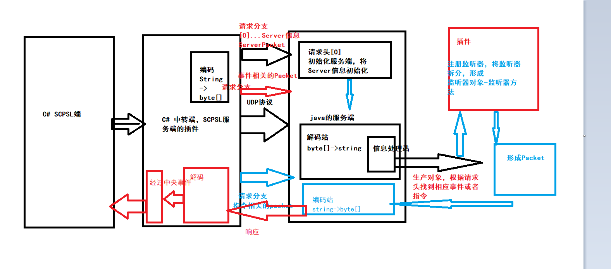

# jsmod2
###### java server mod2 for SCP:Secret Lab.

#### JSMOD2介绍

> 什么是jsmod2

jsmod2项目计划是由magiclu于2019.5.11
,它是一项通过jsmod2_SCPDataNetWork C#服务端进行数据转发，
来和smod2进行交互，从而实现以java开发SCP服务器插件为目的
的服务端插件，它需要依赖SCP SMOD2来兼容运行，通过发送数据包
来讲数据传递给smod2,同时通过jsmod2协议传输数据和序列化对象。

> jsmod2的获取

magic.noyark.net会在jsmod2发布后,定期发布最新的jsmod2的jar运行
包.
也可以通过源代码获取jsmod2,但不提供编译和打包服务.

> jsmod2的架构和开发组

如果您有意愿参与我们开发,您可以向843983728@qq.com发送邮件，
来确认您的开发意愿,jsmod2是免费开源的无偿项目，欢迎有兴趣的
开发者欢迎开发。

项目架构:

# JSMOD2 Java SCPSL服务端

如何实现JSMOD2的数据转发

- 由于SMOD2之中只定义了服务端所需要的抽象类，而没有提供具体的实现类，因此，我们可以通过插件中的事件来进行对数据的序列化和截取

- JSMOD2的转发端为scpDataNetWork,其中规定了数据包和事件数据获取以及通信细节

- 通信细节包括了Server启动时，获取Server数据，并序列化，分发到java服务端，java的Server对象处理数据包，并分发给各插件进行处理

- Java端插件在处理过程向c#端发数据包。C#端接收到数据包后，监听线程会根据包的请求调用相应的方法，从而实现具体功能。

- 具体的解释:

- C#在一个事件发生时，会将事件对象进行序列化，序列化完毕后，转化为数据包，并进行编码，编码完成后，会使用udpsocket发出，被此时对应端口启动的jsmod2端接收，jsmod2端接收后，对数据包解码，转化为请求，根据请求，触发事件，将反序列化的代码，分发给各插件进行处理，处理过程，模拟smod2的api，实际底层是编码数据包并发出，发出后发到C#转发端，根据请求和数据进行相应处理

- 以上为对于转发数据图的解释

JSMOD2的体系

- JSMOD2体系分为JSMOD2主端(java端)和JSMOD2转发端(C#端)，实现数据传递

Java端分为

	插件加载----PluginClassLoader

	监听器的注册----ListenerManager

	SMOD2模拟api---仿照smod2的api体系进行开发，中间加入了传输数据包

	数据包-----遵循SOLSIP协议发布请求

	解码和编码端----遵循udp协议解码和编码

	监听端------Server----中央处理数据包，转发请求

	监听器机制

	配置文件机制
C#端分为

	数据包----遵循SOLSIP协议发布请求和发出响应

	监听数据端-----通过事件监听数据，组合数据包,直接编码发出

	编码和解码端

	中央监听端---负责监听响应数据包，并定位api

SOLSIP协议:为了实现SCP C#与java端之间的通信而规定:
格式

[数据包id]头请求.请求类型…,头请求.请求类型…,
定义数据包功能 定义大类 定义数据

[2]stop, 停止服务器数据包

[1]event.AdminQuery… AdminQuery监听事件数据包

#### JSMOD2-插件学习

- 待开放

#### JSMOD2-组件

- 本项目

- JSMOD2_SCPDataNetwork

- ExamplePlugin
